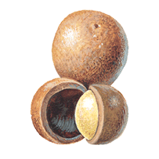

# MacAdamia - A smaller Express

MacAdamia is another one of my nutcase projects. Why nutcase? Because it does something that already exists. In this specific case [Express](http://expressjs.org) and [Connect](https://npmjs.org/package/connect) do pretty much the same thing.

So why do you ask would I write MacAdamia? Because:

  1. If you code it yourself you know it well
  1. Both Express and Connect are real beasts with way too much code for what they do
  1. Both Express and Connect have been around the block and accumulated a huge amount of cruft. This means there is more junk than usefule code in either of them.
  1. I wanted a much simpler and slimmer tool for my web-apps.
    I generally don't need:
    * Sessions
    * Authentication
    * funky request-body parsing (JSON.parse) is usually sufficient
    * CSRF
    * Virtual Hosts

    So while all those are possible with MacAdamia, the focus is on a simple lean framework.

At the same time, Express has become somewhat of a standard. So in order to help people adapt to MacAdamia I tried to stick to the same API, although there are some differences. In fact a lot of Express-Handlers and all Express-Rendering-Engines should work out of the box with MacAdamia.

## Installation

Basically you just install from npm into your applications directory.

    npm install macadamia

## Documentation Server

If you then run

    node node_modules/macadamia/macadamia.js

you have a [documentation server](http://localhost:1234) running on port 1234, which served this documentation folder to your browser for handy reference.

## [API Documentation](api)

## [Included Modules](modules)
